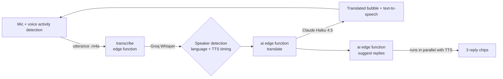

# Talkative

**A real-time interpreter for two people who don't share a language.**

Put the phone between you and just talk. Talkative listens hands-free, works out who is speaking, translates with the context of the whole conversation, reads the translation aloud, and suggests what you could say next.


---

## Why I built it

Translation apps are built for single phrases: tap a button, speak, tap again, hand the phone over. That falls apart in a real conversation, such as a doctor's visit, a landlord meeting or a job interview abroad. Talkative is designed for the whole conversation instead:

- **No buttons.** The microphone stays on and detects when each person starts and stops talking.
- **No turn-taking setup.** It identifies the speaker automatically from the language they speak.
- **Context-aware, not literal.** The translation model sees the recent conversation and your goal ("negotiate the rent down", "explain my symptoms"), so it keeps the intent, not just the words.
- **Help with replying.** After the other person speaks, you get three suggested replies: a direct one, a softer one, and a clarifying question.

## How it works



1. **Listen.** On-device voice activity detection cuts the audio into utterances.
2. **Transcribe.** A Supabase edge function sends the audio to Whisper (`whisper-large-v3-turbo`), which returns the text and the detected language.
3. **Identify the speaker.** The detected language is matched against the two languages chosen for the conversation.
4. **Translate.** Claude Haiku 4.5 translates using the last 8 turns and the user's goal. Prompts are built on the server.
5. **Speak and suggest.** The translation is read aloud while reply suggestions are generated at the same time.

## Engineering highlights

| Problem | Solution |
|---|---|
| Fixed silence thresholds fail in noisy rooms | **Adaptive noise-floor calibration:** samples 1.5 s of ambient sound and sets the speech threshold at the 75th-percentile noise level + 12 dB (clamped to −50…−20 dB). The value is reused across recordings, which removed a 1.9 s dead zone that merged consecutive utterances. |
| Knowing who spoke without voice enrollment | **Language-based speaker detection:** Whisper's detected language is matched to each participant. For same-language edge cases it falls back to TTS timing (speech right after the app talks is attributed to the other person). |
| The mic hears the user reading a suggestion aloud | **Echo-loop prevention:** transcripts with ≥ 50 % word overlap with a shown suggestion are discarded. |
| Latency between translation and suggestions | **Parallel execution:** suggestion generation starts at the same time as text-to-speech, so replies appear almost immediately. |
| API keys in a mobile app can be extracted | **Server-side secrets:** the app holds only a Supabase anon key. Groq and Anthropic keys live in edge-function secrets. |
| Unbounded LLM spend | **Per-user quota in Postgres:** each account starts with 300 translation units. The backend returns HTTP 402 when they run out, and the app stops the mic with a friendly message. Every call is logged to `usage_events` with token counts. |

## Features

- Hands-free, continuous listening that starts automatically
- Automatic speaker detection across 16 languages, including German, Hindi, Telugu, Arabic, Chinese and Japanese
- Context-aware translation with Claude Haiku 4.5
- Three suggested replies after each turn from the other person
- Spoken output with per-language voices (mute toggle)
- **Briefing modes:** a one-line goal, or a short interview with an AI coach that builds a detailed conversation strategy
- Email and password accounts with sessions persisted on the device

## Tech stack

| Layer | Technology |
|---|---|
| App | Expo SDK 54, React Native 0.81, TypeScript, React Navigation 7 |
| Audio | expo-av (recording and metering), expo-speech (text-to-speech) |
| Backend | Supabase: Auth, Postgres (profiles, quota, usage log), Deno edge functions |
| Speech-to-text | Groq Whisper `whisper-large-v3-turbo` |
| Language model | Anthropic Claude Haiku 4.5 (translation, suggestions, briefing coach) |

## Project structure

```
src/
  screens/        Auth, Briefing, DetailedBriefing (AI coach), Conversation
  hooks/          useAudioRecorder: VAD, calibration, recording lifecycle
  services/       api (backend calls), tts, speaker (speaker detection)
  context/        global state: briefing, messages, session, quota
  constants/      supported languages, theme tokens
supabase/
  migrations/     profiles, quota and usage_events schema
  functions/
    transcribe/   Whisper proxy (quota-gated)
    ai/           Claude proxy: translate, suggest, coach
```

## Running it yourself

You need Node.js 20+, an Android device or emulator, and a free [Supabase](https://supabase.com) project.

1. Deploy the backend (database, secrets, edge functions) by following **[SETUP.md](SETUP.md)**.
2. Configure and start the app:

   ```bash
   npm install
   cp .env.example .env        # add your Supabase URL and anon key
   npx expo run:android        # build and run on a connected device
   ```

3. To build a standalone APK:

   ```bash
   npx eas-cli build --profile preview --platform android
   ```

## Known limitations and next steps

- **Not streaming yet.** Whisper transcribes whole utterances, so text appears after each sentence rather than word by word. A streaming STT provider is the next step.
- **Same-language conversations** rely on the timing heuristic, which is less reliable than language matching.
- **No password-reset emails** on the Supabase free tier, which has no custom SMTP. See [SETUP.md](SETUP.md).
- **Planned:** paid top-ups. The quota model already supports them, so only a payment webhook is needed.

## License

[MIT](LICENSE) © 2026 Ranadheer Podishetti
